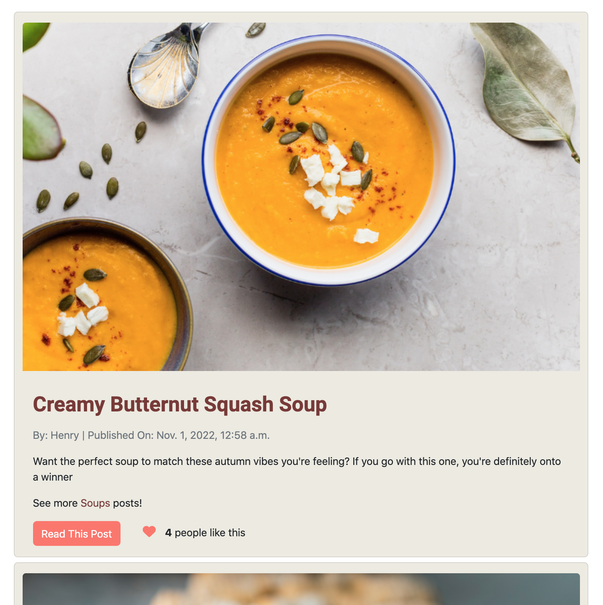
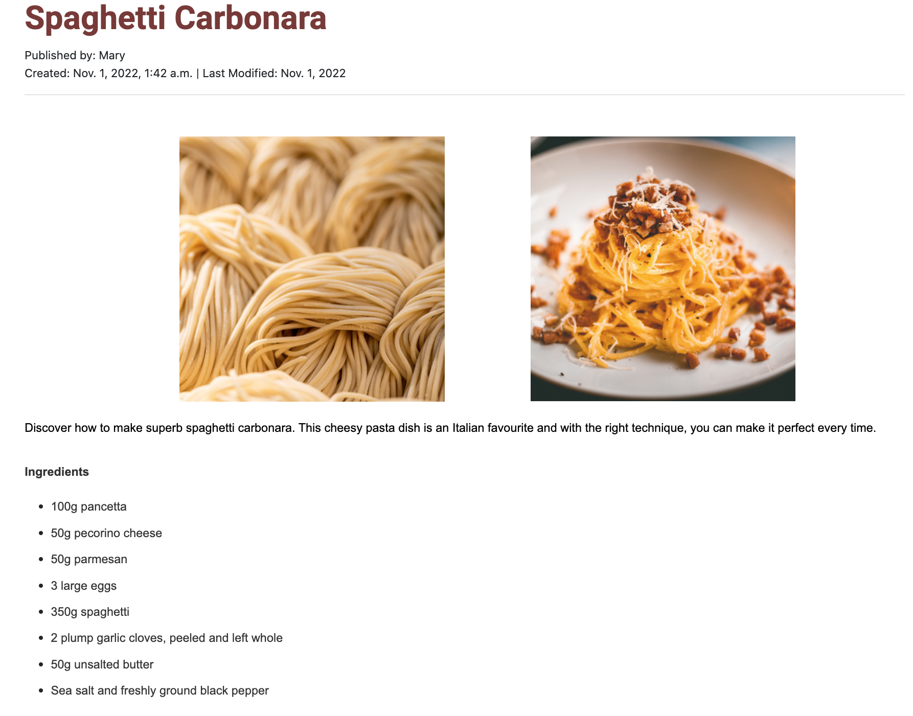
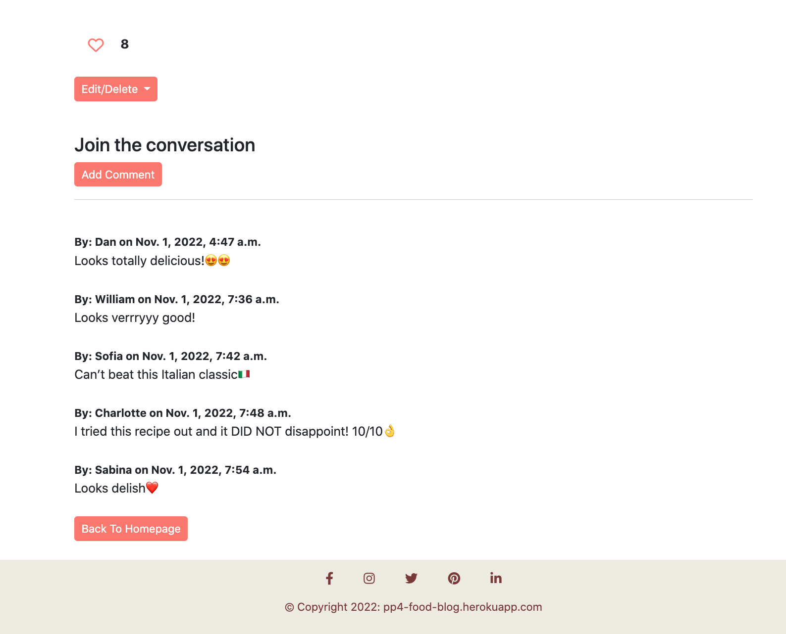
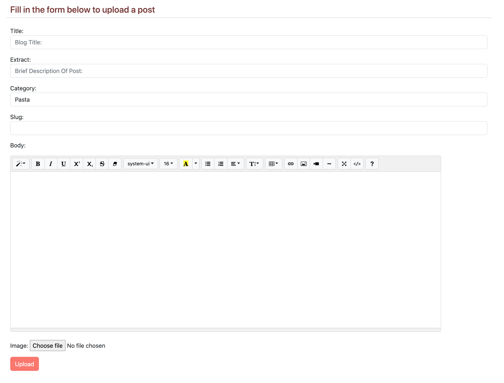
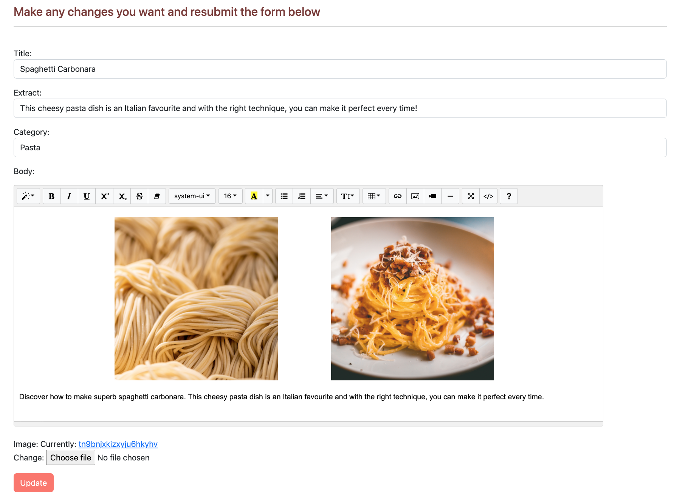
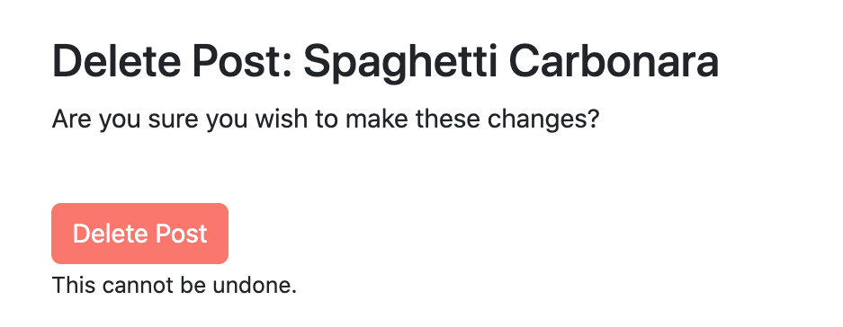
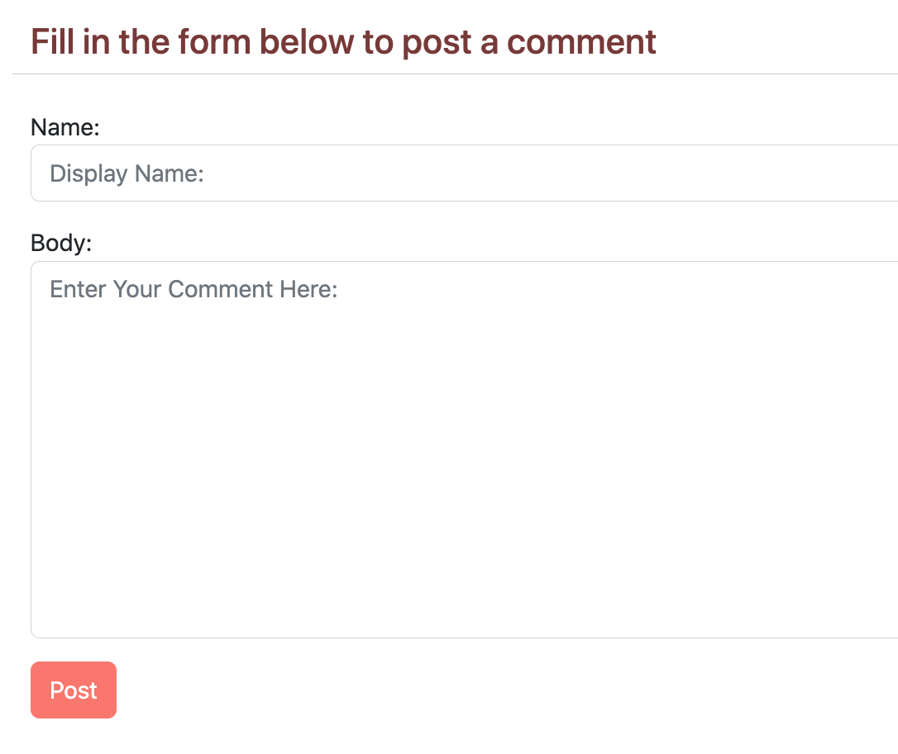
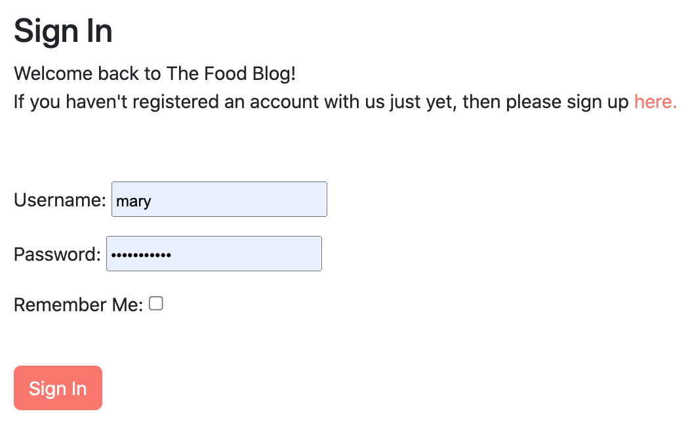
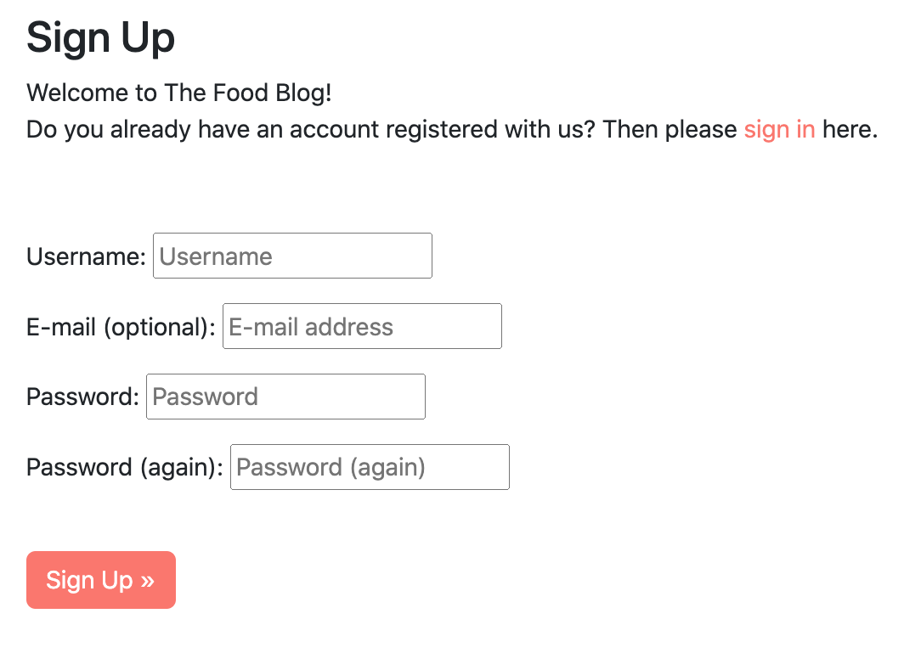
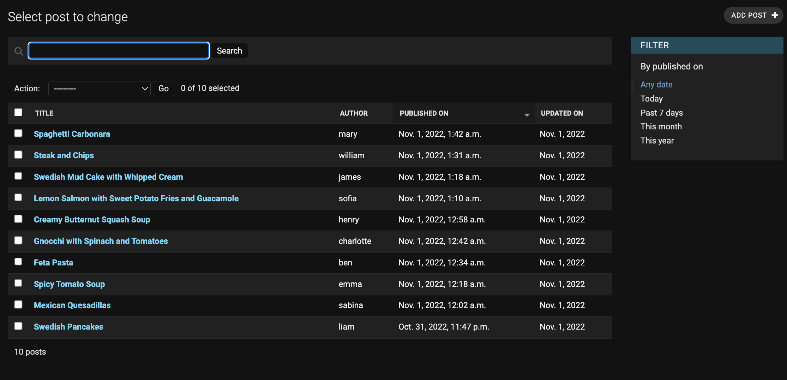

# The Food Blog PP4

The website I decided to make is a food blog which lets users visiting the site, explore numerous different recipes, while also sharing their own cooking tips and tricks. The goal of the blog site is to give people an easily accessible website to find delicious recipes, and to also give users their own platform to be able to share their love of cooking and baking with the world. This blog is aimed at anybody that has a passion for cooking and wants to discover new recipes or ideas. Also, people who just want to share their own thoughts and opinions on anything food related will feel welcome in this friendly, passionate community.

Users have the ability to register for an account and this will then allow them to like and comment on blog posts as well as giving them the ability to upload their very own posts and recipes. Any blogs uploaded by users will need to be verified and published by the site admin before it becomes live on the website. This is to ensure the content is relevant and that we do not become a platform where offensive or discriminatory views are being spread amongst our community. Comments are free to be posted by any registered users, but they too will be monitored for any remarks that breach our community standards.

(Insert AmIResponsive image here)

# Current Features

## Home Page

This is the initial page users visiting the site will land on. At the very top is the blog name alongside the navigation links leading to other pages of the website. These links will change depending on what area of the site you are on and whether or not you are signed in with your account. There is the standard login, logout and register for an account buttons. On top of that, there is also a browse categories dropdown list. This makes it quick and easy to find whatever it is that you are interested in reading.

Directly underneath the navigation, there is a intoductory paragraph welcoming visitors to the site along with a brief description of what you can find and do while visiting the blog site.

The rest of the content on this home page are blog posts that have been uploaded by other people. A maximum of four posts are present per page before it is paginated and will have to click next to explore more posts. Each blog is displayed in a card showing a large image, the blog title and a brief introductory text outlining the content incase you wish to open the post and read further. The purpose of the image is to give the reader an insight into what content the blog contains without having to open the post first. Since the majority of posts on the site are recipes, it makes sense to attach an image of the finished dish here. 

Each blog uploaded gets assiged to a category chosen by the author at the time of publication. Also on the card is a link that if clicked, will take you to more posts within the same category as the one you are reading. The purpose of this is to make it as simple as possible to find blogs that you are interested in. The number of likes each post has is also present here. If you want to like a post yourself, you will have to open it fully first and also be a registered user.

If you are the user that uploaded the post, you will see two extra buttons, edit and delete. These are present to make it as simle as possible to make changes or completely delete a blog that you uploaded. Clicking either of these buttons will take you a seperate page where you can make any changes you desire before being redirected back to the homepage. Authentication is present to ensure only the author of the post is the one that has access to this functionality.

Lastly at the bottom of the home page, you will find the footer. I kept this very clean and simple. It contains links to all the relevant social media and standard copyright information.

## Full Blog Post Page

When a user clicks on a link to open a post fully, they are greeted with a fully formatted, traditonal blog post layout. The blog title is displayed in a large header tag at the top of the page, with further information stating the author and when the post was created/last updated.

The way the blog is laid out in relation to the formatting and inclusion of images is totally up to the person who uploaded it. Most of the blog posts currently uploaded contain pictures at the top of the page as I feel anyone visiting the site will get drawn in more by images along with quality text content that follows it. 

As blogs have to be approved by the admin before publication, this helps to ensure the content being shared is relevant to the sites purpose and that the quality of the posts are up to the standard that the site admin would like. Adding to that, it is a much easier way to monitor posts rather than having to manually scroll through every published blog and pick out any for editing or deletion incase of a error or misuse of the platform.

Directly under the blog content, is a like button and a section containing the comments. Here it once again shows the number of likes the post, but this time also with the ability to like the post yourself. You can click the like button only if you are signed in. If not, there is a comment explaining this and a link that will take you to the 'Register for an account' page.

The same applies as above for the comments section. Any comments the post has received already are displayed here, along with the name of the user and the date it was made. If you are a signed in user, you can click the 'Add comment' button and be taken to the page where you can leave comments.

At the very bottom of the page is one last button, that if clicked will take you back to the homepage. 

## Blog Category Page

From the navigation menu at the top of the website, you can use the dropdown 'Browse Categories' to pick what type of blogs or recipes you would like to see. When you have made a selection, you will be taken to the categories section of the website.

At the top of the page, you are greeted with a large banner image along with the title of the category that you have selected. The content on this page is determined by which category is chosen by the user when uploading a blog post. As the amount of content on this site grows, more categories are sure to be added but for the time being I am trying to keep the amount under ten. I considered adding the functionality to let users create their own categories, but I came to the conclusion that this would very quickly become too much to handle. Therfore, I have left the decision to add more categories up to the site admin.

The page layout is very similar to the home page, the obvious exception to this being that you can now easily find a specific recipe or cuisine much faster than scrolling through the entirety of the site.

## Upload Blog Page

When you are all signed up with an account, the 'Upload Post' page will then become available for you to use! This is the page you will be using to uplaod all of your wonderful recipe ideas. 

The format of the page is a form primarily, composing of the fields you will need to fill in to upload a post. At the very top, is a line of text outlining the steps to fill out the form correctly. The form consists of six fields that are to be filled in. Most of them are self explanatory such as the title, extract and category. One or two of them are a little bit more complicated such as the 'slug' field. This is the url that will be displayed for the post that you create for example /your-first-post/. There is a placeholder telling you to include the - symbol between words so the slug is accepted. The ideal situation would be for this to be automatically generated from the title but unfortunataly, I did not get time to implement this before my submission date.

Underneath the slug field, is the main body of the blog post that you will create. I implemented a text editor called summernote here, so you have more capabilities to format and customise your posts. The editor includes options to change fonts, colours, add pictures and much, much more. Getting this implemented into the form was imperative, to ensure the content being put out is posted with the correct formatting and so its as simple as possible to put together a good-looking blog.

The last field on the form is the ability to attach a picture which will feature as the primary image on the home screen of the website. It is not possible to see an example of how it will look so its quite important that the image you use is the correct size so it is not altered in any way. If it does not come out as expected, theres no need to worry as this can be swapped out easily in the edit page which is described in more detail below.

## Edit Blog Page

The edit post page can be accessed either on the home page or at the bottom of the actual blog post when it is opened fully. Only you who wrote the post has access to this page so you don't have to worry about anybody else editing or deleting your blogs.

This page is very similar to the previous 'Upload a Blog' page, with just a few minor differences. The edit page lets you change everything except the slug field. All of the content that you have wrote here previously is present, and you are free to change whatever you like and then click the update button. Any changes will be saved and you will then be redirected to the home page with a freshly updated post.

## Delete Blog Page

Very similar to the edit page above, this option is only available to authors of the particular post. Clicking this button redirects you to a seperate delete page, where you then need to confirm your decision by clicking 'Delete post'. This page contains nothing more than a button and a message stating this decision cannot be changed. Once deleted, your post is removed from the database and will consequently disappear from the website.

## Commenting Page

If you are signed in and wish to comment on a blog post, you will find a button at the bottom of any post which when clicked takes you to the add comment page. In order to stop the page becoming too congested, I decided to add this feature on a seperate HTML page. 

It is a simple form page, with just two fields. One for your name and another for the comment. If you wish to stay anonymous, you can leave the name field blank or input something different than your real name. When you click post comment, you are redirected and the comment will be posted to the corresponding blog post, with the name you rovided and the date you wrote it.

## Sign In/Out Page

For all the authentication on this blog site, I used the Django AllAuth built in authentication system. This comes with already made html pages for signing in and out. These pages can be accessed and edited which I have the documented steps outlined further on in this read-me. 

The sign-in page consists of a message welcoming you back to the blog and a link to register for an account if you have not yet signed up. Below this is a username and password field with a 'remember me' check box. Its a simply styled, standard sign-in page and once all fields are filled in you can then click sign in.

The sign-out page is just as simple, consisting of only a message asking if you're sure you want to log out and a sign-out button.

## Register An Account Page

Registering for an account uses the same AllAuth authentication system as above. This page contains four form fields, a username, an optional email field, a password and a repeat password box. 

There is a welcome message at the top of the page which also has a link incase you have an account registered with us already. The username input has to be unique to yourself, and optionally you can also provide us with an email address. Lastly, there is a standard password field which you have to repeat in a second box. Once the form is filled in, click the sign-up button and then registration is complete.

## The Admin Panel

One of the first steps undertaken in development was the creation of the administration panel and registering the admin superuser. This account then has full CRUD functionality over every post and comment on the website. 

Upon doing this I also customised the admin panel to make it easier to manage posts and track there created date, author etc. On the panel you can filter posts and publish user created draft posts to the live site. Theres a seperate panel for all of the comments that can also be filtered through so they are easily manageable. If a post or comment needs to be modified or deleted entirely, it is super simple to tracl it down and perform this operation from the admin panel.

The login for the superuser account is as follows -

***Username - admin***\
***Password - esporta1993***

# Future Features To Implement

## Contact Form with EmailJS functionality
This was a feature that I originally hoped to include in my project. The ability to reach out to the site admin is a useful feature for any website, as any questions or issues can be sent directly to the person responsible which makes good customer service. 

## Newsletter With Monthly Updates
The ability to reach out directly with your registered users is a great addition for any blog site. Its good for keeping people updated on important information, newly released content or special offers. 

## Video Recipe Walkthroughs
This is an extra feature that I would of loved to have the time to try and implement. I am one of the many people that really learn by watching and introducing this ability would be especially helpful on a cooking tutorial/recipe blog such as this.

## Sign In With Social Media
This was another feature that I planned to implement in the planning stages of this project, but unfortunately did not have time to implement. This is just much better user experience and makes the signing in/out alot more hassle free.

# The Agile Approach

Throughout the planning stages of this project, I tried my best to implement Agile best practises. Before starting with any practical elements of this website, the first thing I did was write out a list of user stories with perspectives from a site user, a registered user and lastly the site admin. Accompanying each user story is a list of the required tasks needed to fully implement the new feature. I referenced back to the user stories regularly throughout production, updating them when a new feature was completed, as well as adding new stories and removing others that no longer applied.

I attached labels to each user story, which were to represent how many story points each one was worth. Throughout the production, I became aware of a number of them where the amount points assigned were not a true representation of how long it took to implement the feature. Certain bugs would sometimes slow me down significantly or I just misjudged how long it would take to realistically accomplish what it was I was trying to achieve. On the other hand, there were also times when things went much smoother than I anticipated and so I completed for example, an eight point user story a lot quicker than what I though it would take. I see this to be a learning process as it is my first time attempting to use a true agile approach. Hopefully, the more projects I work on in the future, the more accurate I will become at predicting workloads and the time it takes to implement the features.

You can find my user stories listed under the issues section of my GitHub repository, along with how many story points each one represents. I also used the projects tab and the kanban board as shown in the Django Blog walkthrough project to keep track of my user stories and move them from the In-Progress to Done throughout the development. This helped me considerably to understand what I had left to implement while also keeping my motivation high as those small steps soon add up to a considerable portion of work being completed successfully.

# Languages/Libraries Used

- Django
- Python
- HTML/CSS
- Bootstrap
- Cloudinary
- AllAuth Authentication
- Summernote Text Editor

This project was built primarily using Django and Python languages. HTML was also used throughout to implement numerous different webpages. The majority of styling throughout the site was done using Bootstrap classes, but to customise these further I implemented my own custom CSS styling to overwrite some of the more standard bootstrap style classes.

I used Cloudinary for some of the image file storage. This is because Django uses an ephemeral file system, so Cloudinary was a good choice to prevent my image files from being deleted after a certain amount of time has passed. For other image files, I used standard static file storage in my Gitpod workspace.

As stated earlier in this read-me, Django's own AllAuth authentication system was used in this project for signing in, signing out and registering an account. In order to customise the already created HTML files I had to input the following command into my terminal to copy the files and save them in my own workspace - 
cp -r ../.pip-modules/lib/python3.8/site-packages/allauth/templates/* ./templates

To allow users to upload a fully formatted blog post, with customisable text, styles and colours I used the text editor Summernote. This editor can be used in the admin panel as well as on my template pages including the 'Upload Post' and 'Edit Post' pages.

# Colour Scheme 

I looked through many different websites to try and gather some ideas for implementing color into the site. I eventually decided on my own take of the below color scheme. I wanted to use bright, vibrant colours that would attract peoples attention and fit the vibe of the recipe/food blog.

(color scheme pic here)

# Deployment

## Local Deployment

The points below outline the steps that I took to deploy my project to a local server - 

* Create a new GitHub repository 
* Select the Code-Institute-Full-Template and name your repository
* Press the Gitpod button to open a new Gitpod workspace
* Download all the required dependencies. Django, Psycopg2, gunicorn etc
* Create a requirements.txt file using command pip3 freeze --local > requirements.txt
* Create a new Django project using command django-admin startproject "project-name-here" .
* Create a new app using command python3 manage.py startapp "app-name-here"
* Add the above app name to list of installed apps in settings.py file
* Migrate these changes using command python3 manage.py migrate
* Run the project using command python3 manage.py runserver
* The project should now be running locally on port 8000

## Live Deployment

The steps outlined below, document the steps taken to deploy my live project to Heroku

* On GitHub, I forked my repository so it is not deleted after inactivity
* Navigate to Heroku.com, sign into your account and create a new app 
* I named my app pp4-food-blog and picked the European region
* Go to the Resources tab, search for PostGres and confirm 
* Submit the order to confirm you want to use the PostGres database
* Create an env.py file on top level of your file system
* Import os to env.py file and copy your database-url from heroku config vars
* Create your variables in the env.py file - os.environ.get['DATABASE_URL'] = 'copied url from heroku'
* Create your own secret_key variable and add to env.py as outlined above
* Add secret_key value to config vars on heroku
* Navigate to settings.py file
* import os & dj_database_url
* Also add - if os.path.isfile(env.py): import env
* Replace secret variable on settings.py with os.environ.get('secret_key')
* Comment out databases section on settings.py and replace with 
DATABASES = {'default': dj_database_url.parse(os.environ.get('DATABASE_URL))}
* You're now using Postgres database on the backend
* Migrate changes the same way as outlined above
* Add PORT and value 8000 to heroku config vars
* In settings.py file, add code TEMPLATES_DIR = os.path.join(BASE_DIR, 'templates')
* In TEMPLATES - DIRS add the value [TEMPLATES_DIR]
* In ALLOWED_HOSTS add ["'app-name-here'.herokuapp.com", 'localhost']
* Create a procfile on top level of your file system
* Add code to procfile - web:gunicorn 'app-name-here'.wsgi
* Commit and push changes to Github
* Navigate to Deploy tab on heroku
* Connect to your GitHub account and type your repository name 
* Click deploy and your project should now be live

The link to my live website can be found at - https://pp4-food-blog.herokuapp.com/

# Testing

## Manual Testing

## Automatic Testing

## Validator Testing

## Lighthouse Results

# Bugs

## Unfixed Bugs

 - One bug I encountered was with the footer refusing to stay at the bottom of the page if there wasn't enough content on the page. The only pages where this is now an issue, is with the sign-in/sign-out and register for an account page. Because of this I removed the footer all together from these pages.

 - When creating a blog post from the html page via the form, users have to manually add the slug field themselves. I wanted to figure out how I could get the slug to generate itself from the blog title but unfortunately I didn't have time to fix this before my submission. Just to give users some kind of guidance, I added a placeholder explaining how to format the slug so it is accepted and appropriate to the blog content.

 - The navigation dropdown link listing the blog categories would not loop through them correctly and work as intended on the full_post.html page. I managed to add the correct code to my views.py file on all other views except for this one. I didn't have the time to squash this bug before my deadline so to get around it, I removed the nav-link from the page entirely. 

## Fixed Bugs

- While attempting to delete blog posts from within the website, I had an error stating I needed to provide a success_url for after a post is deleted. After researching, I discovered the url from my post model would not work as I had to import reverse_lazy as the standard reverse would not work in this instance.

- Implementing a feature so the user would not have to manually select which blog post you want to comment on every time. Originally, you would have to choose from a dropdown list even after navigating directly from the psot you wanted to comment on. I fixed this problem by defining a form_valid function, by which I could then associate the post ID with the comment resulting in the blog post being auto selected. 

# Credits

 - Code Institute Slack groups most notably the project-portfolio-4 & project-milestone-4 groups. Almost every question I had, I could find an answer for in these groups!

 - I Think Therfore I Blog Code Institute walkthrough project. This walkthrough really helped me wrap my head around the Django language and how to navigate the numerous files that you have to set up.

- I researched from numerous sources the best way to implement CRUD functionality and this helped me to implement it in my project. 

- I used Canva to crop and edit numerous images I used in this website.

- I used the following website to decide on what color scheme to implement for my ptoject -
https://webflow.com/blog/best-color-combinations

- BBCGoodFood was used for the steak and chips and for the carbonara recipe.

